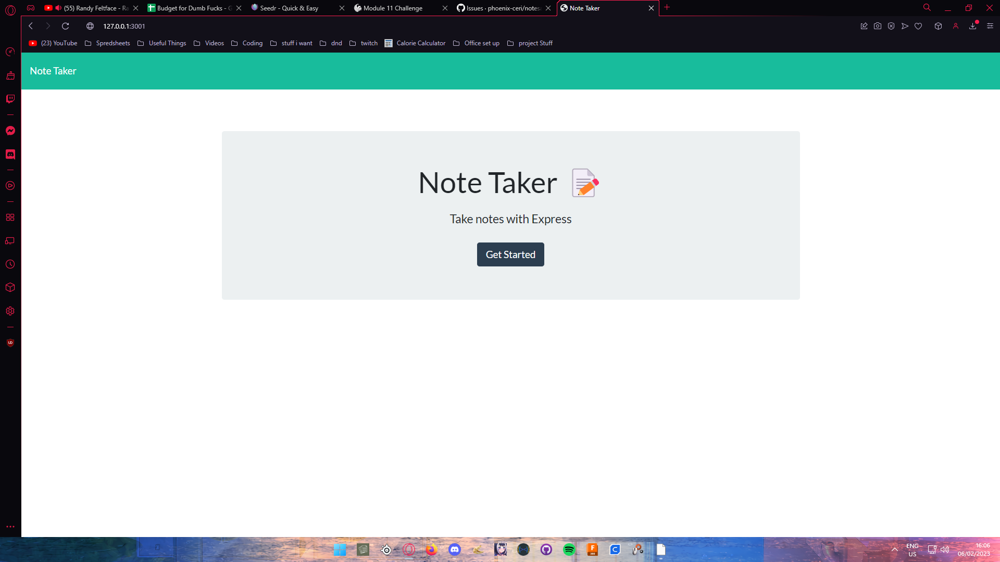
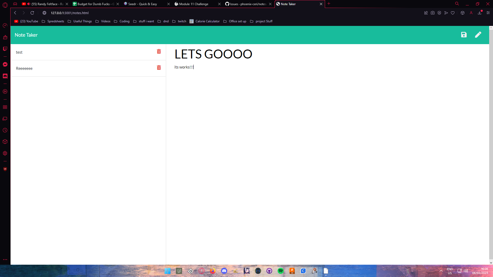

# Note Taker App

  

  ## Table of Contents
  * [Description](#description)
  * [Installation](#installation)
  * [Usage](#usage)
  * [Licenses](#licenses)
  * [Contributing](#contributing)
  * [Tests](#tests)
  * [Questions](#questions)
  * [Credits](#credits)

  ## Description
  This is a note taker application to help you keep track of notes and tasks

  ## Installation
  there is no instal. this app runs off heroku

  ## Usage
  open the heroku link. then click the start button. type the note out. save it and then acess it later!
  
  

  ## Licenses
    This project is covered under the MIT license. To learn more about what this means, click the license button at the top.

  ## Contributing
  No controbutions are needed

  ## Tests
  no tests

  ## Questions
  Have questions about this project?  
  GitHub: https://github.com/phoenix-ceri  
  Email: phoneixceri@protonmail.com

  ## Credits
  Phoenix-Ceri Mastin
